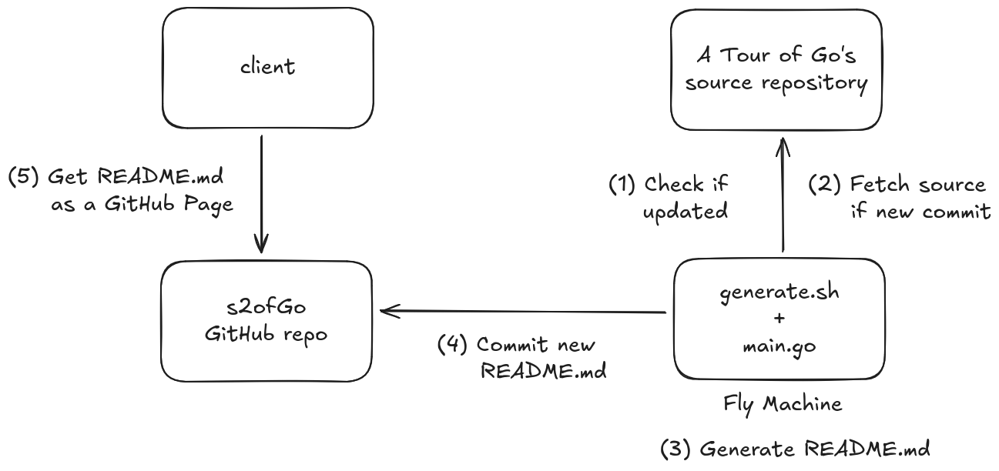

## Overview of the setup behind s2ofGo

[s2ofGo](https://zputrle.com/s2ofGo) combines [A Tour of Go](https://go.dev/tour/welcome/1) into a single web page, making it easy to search the content using Ctrl+F. The page is stored as a single Markdown file ([README.md](./README.md)) and published using [GitHub Pages](https://docs.github.com/en/pages). This Markdown file is generated by crawling [A Tour of Go’s source repository](https://go.googlesource.com/website/+/refs/heads/master/_content/tour/) with a program written by [Claude](https://claude.ai/login?returnTo=%2Fnew%3F) and later refined by hand.

Since A Tour of Go is not often updated, we could run the script only occasionally to refresh the page, but this seemed like a good excuse to try out [Fly.io](https://fly.io/). Just spin up a [Fly Machine](https://fly.io/docs/getting-started/essentials/) once per day and check whether A Tour of Go's repository was updated. If so, generate a new README.md file and push it to the GitHub repository.

**Architecture**: Figure 1 shows a high-level architecture of the setup. The Fly Machine is generated from a Dockerfile. Each time the machine starts, it runs the [`generate.sh`](./generate.sh) script that (1) checks if the repository was updated, (2) retrieves A Tour of Go's source if there is a new commit, (3) runs main.go to generate the README.md file and (4) pushes it to the s2ofGo repository where (5) it is served as a web page through GitHub pages. 

  

Figure 1: High-level architecture

The Fly Machine does not preserve state during runs. The only thing the `generate.sh` needs to remember is the last commit from which the README.md is generated, and that is stored in the s2ofGo repository alongside README.md. This way we avoid storing any state on fly.io which makes the management of the setup easier.

**Cost**: Since we use a Fly Machine with a single core and 512 MB of memory, and the machine is stopped most of the time, the running cost should be less than 1 EUR per month. Additionally, to ensure that the machine is not running continuously, we limit its runtime by automatically stopping the `generate.sh` script after 3 minutes using the `timeout` command. This way, even if the `generate.sh` script hangs, the machine will only run for 3 minutes per day.

**Security**: Regarding security, the only thing we are protecting is the [GitHub personal access token](https://docs.github.com/en/authentication/keeping-your-account-and-data-secure/managing-your-personal-access-tokens) that allows the generate.sh script to commit to the s2ofGo repository. Everything else is public. The token is stored as a secret in a Fly App, which makes it available as an environment variable inside the machine. This means that (Footnote 1) an attacker can only leak the token if they can execute code in the machine. As the machine does not have any open ports, and the only two external inputs that the generate.sh script uses — the `last_commit.txt` file and A Tour of Go’s source repository — are not controlled by an attacker, the attacker will have a hard time executing code inside the machine.

**Footnotes**:
- Footnote 1: Under the assumption that the Fly.io's infrastructure works as expected.
